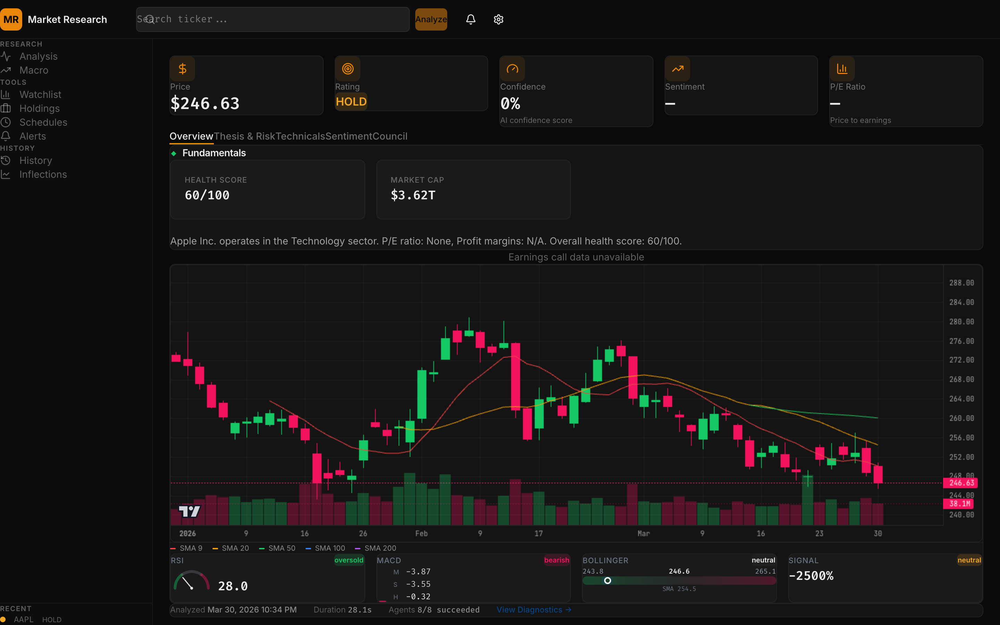
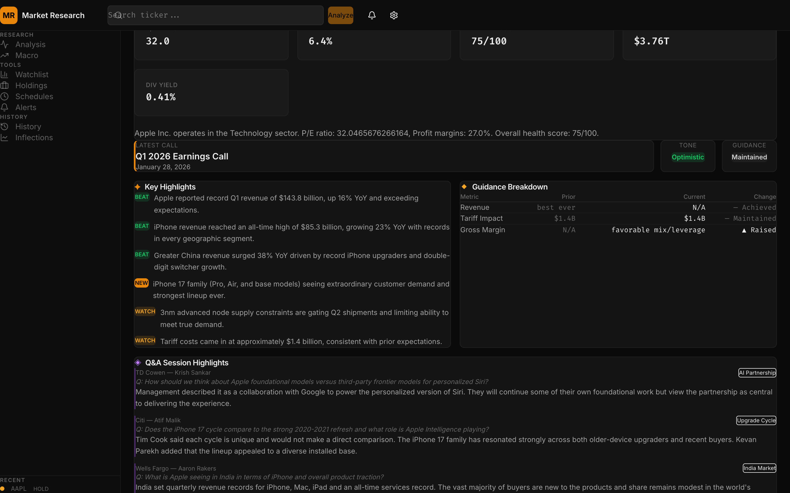
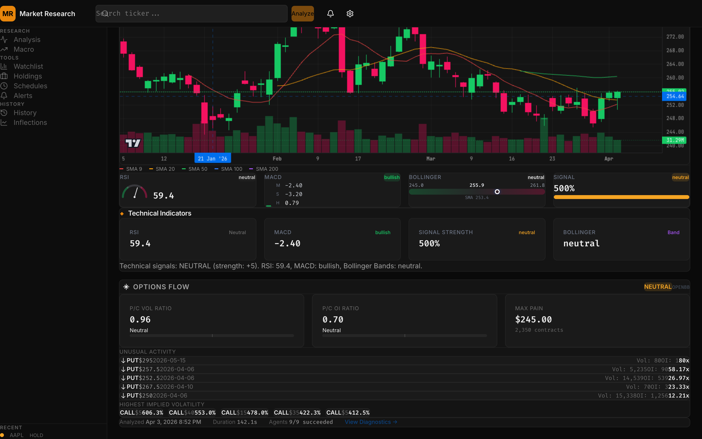
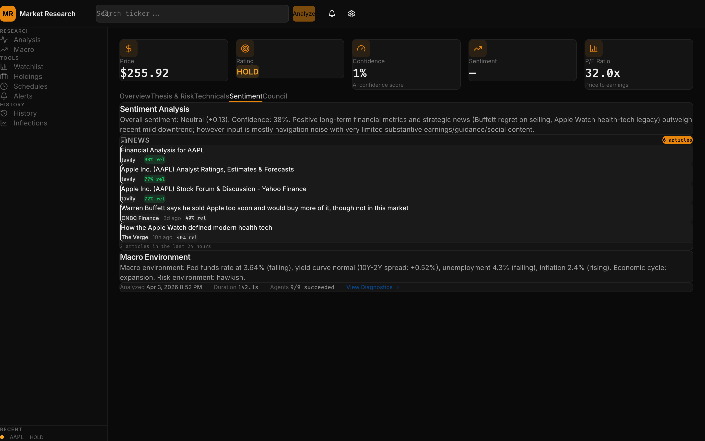

# Multi-Agent Market Research Platform

Real-time AI-powered US equity analysis with a quant PM upgrade layer.

## Screenshots

### Analysis Dashboard

*KPI cards, Company Arc narrative, and year-by-year financial performance powered by 9 parallel agents.*

### Fundamentals & Earnings

*Structured earnings digest with key highlights, guidance breakdown, and Q&A session analysis.*

### Technicals & Options

*Interactive price chart with RSI, MACD, Bollinger Bands, and real-time options flow analysis.*

### Sentiment & Macro

*AI-powered sentiment scoring across news, social media, and analyst ratings with macro environment overlay.*

## Overview
This platform runs 9 specialized data agents (news, sentiment, fundamentals, market, technical, macro, options, leadership, earnings) in parallel, then runs 6 synthesis agents simultaneously (solution, thesis, earnings review, narrative, tag extractor, risk diff) to produce institutional-grade research output — all via `asyncio.gather()` with zero added latency.

### Core Analysis Pipeline
- **9 data agents** gather real-time market data, financials, earnings transcripts, news, technicals, macro indicators, options flow, and leadership assessment
- **6 synthesis agents** run in parallel to produce: final recommendation, bull/bear investment debate, structured earnings digest, multi-year financial narrative, qualitative company tags, and SEC filing risk factor diffs
- **Deterministic guardrails** validate all LLM output with evidence grounding, cross-reference checks, and sanity clamping

### Quant/PM Layer
- Deterministic `signal_contract_v2`
- Optimizer-driven `portfolio_action_v2`
- Calibration economics and reliability bins
- EV/regime/quality-aware alerts
- Cross-sectional watchlist opportunity ranking
- PM-focused dashboard tabs and cards

By default, long-form chain-of-thought is not persisted or shown (`COT_PERSISTENCE_ENABLED=false`).

## CapRelay-Inspired Research Features

Institutional-grade research capabilities inspired by [CapRelay](https://www.caprelay.com/), built natively using existing data sources and the agent architecture.

### Bull/Bear Thesis Debates (`thesis_agent.py`)
Two-pass LLM generates structured investment debates with:
- **Bull and bear cases** — thesis, key drivers, near-term catalysts
- **Tension points** — adaptive count (3-8) of genuine disagreements with evidence from both sides
- **Management questions** — CEO/CFO questions tied to specific thesis tensions
- **Three-layer guardrails** — prompt instructions, deterministic evidence grounding, cross-reference against agent data

### Structured Earnings Digests (`earnings_review_agent.py`)
Single-pass LLM produces institutional-quality earnings reviews:
- **Deterministic beat/miss** — EPS computed from structured data (no LLM needed), with revenue and guidance delta
- **Sector-specific KPI tables** — 7 sector templates (Technology, Financial Services, Healthcare, etc.) guide extraction, plus LLM catches call-only disclosures
- **Management tone, notable quotes, thesis impact, one-off identification**
- **Partial results** — deterministic beat/miss still produced even when no transcript available

### Multi-Year Financial Narratives (`narrative_agent.py`)
Two-pass LLM weaves multi-year financial data into a coherent investment story:
- **Configurable year span** — default 3 years (`NARRATIVE_YEARS` config)
- **Year sections** with revenue/margin trajectories, strategic moves, capital allocation
- **Selective quarterly inflection highlights** — only materially significant quarters flagged (not every quarter)
- **Thematic narrative chapters** — cross-year threads like "The Services Transition" or "The China Question"
- **Hybrid data fetching** — agent fetches its own multi-year financials + transcripts from data provider

### Qualitative Company Tagging & Screening (`tag_extractor_agent.py`)
Lightweight LLM classifies companies with a fixed taxonomy of 36 tags across 5 categories:
- **Business Model** — recurring_revenue, platform_business, subscription_transition, etc.
- **Corporate Events** — activist_involved, recent_ceo_change, major_acquisition, etc.
- **Growth Drivers** — pricing_power, ai_integration, geographic_expansion, etc.
- **Risk Flags** — customer_concentration, debt_heavy, secular_decline, etc.
- **Quality Indicators** — high_roic, network_effects, switching_costs, etc.

Tags persist via upsert (never auto-deleted), with `first_seen`/`last_seen` timestamps. Screening API: `GET /api/screen?tags=recurring_revenue,pricing_power&max_age_days=90`.

### SEC Filing Risk Factor Diffing (`risk_diff_agent.py`)
Two-pass LLM compares risk factor sections across SEC filings:
- **Hybrid data sourcing** — FMP for filing metadata + EDGAR for full-text HTML
- **Smart HTML parsing** — BeautifulSoup + regex fast path with LLM fallback for messy filings
- **Filing comparison** — two most recent 10-Ks + latest 10-Q (3 filings max)
- **Change detection** — classifies each risk as new, removed, escalated, de-escalated, or reworded
- **Risk score** — 0-100 composite with period-over-period delta
- **Graceful degradation** — 1 filing produces risk inventory only, 0 produces empty result

## Perception Ledger & Inflection Tracker

Tracks how the market's perception of a company's fundamentals is shifting over time — across earnings guidance, analyst estimates, sentiment, technicals, and macro conditions — and flags when multiple sources converge on the same directional shift.

### How It Works
Every analysis run captures ~30 KPI snapshots into an append-only **perception ledger**. An **inflection detector** compares current vs prior snapshots, scoring each change against category-specific thresholds and computing a **convergence score** measuring cross-source agreement.

### KPIs Tracked
| Category | KPIs |
|----------|------|
| Valuation | forward_pe, price_to_sales, return_on_equity, debt_to_equity |
| Margins | profit_margins, operating_margins |
| Growth | revenue_growth, earnings_growth |
| Guidance | revenue_guidance, eps_guidance, capex_outlook (from earnings transcripts) |
| Analyst | analyst_target_median/high/low, analyst_count |
| Sentiment | overall_sentiment |
| Technical | rsi, macd_signal |
| Macro | fed_funds_rate, cpi_yoy, gdp_growth, yield_spread |
| Options | put_call_ratio, max_pain |

### Convergence Scoring
```
convergence_score = agents_agreeing_on_direction / total_agents_with_inflections
```
Multiple KPIs from the same agent count as one agent — prevents the fundamentals agent from dominating the score.

### Inflection Dashboard
A dedicated "Inflections" view provides:
- **Ticker Heatmap** — Watchlist tickers ranked by convergence score
- **KPI Time-Series Chart** — Historical KPI trajectories with inflection points
- **Inflection Feed** — Chronological event feed across all tracked tickers

### Scheduled Tracking
Watchlists can be configured for automatic re-analysis:
- **Morning** (9 AM ET weekdays)
- **Evening** (4 PM ET weekdays)
- **Twice Daily** (both)

### Alert Integration
New `inflection_detected` alert rule type fires when convergence score exceeds a configurable threshold.

## Leadership Evaluation Agent
The platform now includes a **Leadership Agent** that evaluates company leadership quality using the **Four Capitals Framework** (Athena Alliance / McKinsey):

1. **Individual Capital** — Self-reflection, vision clarity, cognitive focus, diverse experiences
2. **Relational Capital** — Deep 1:1 relationships, behavioral integration at the top team
3. **Organizational Capital** — Management rituals, accountability structures, culture hardwiring
4. **Reputational Capital** — Strategic storytelling, consistency between words and actions

## FMP Ultimate Data Integration
The platform leverages **FMP Ultimate tier** for comprehensive financial data:

### Expanded Data Endpoints
- **Analyst Consensus** — price target high/low/median, analyst count
- **TTM Financial Ratios** — P/E, P/B, P/S, P/FCF, margins, ROE, current ratio, debt/equity
- **Financial Growth Rates** — revenue, EPS, operating CF, free CF growth (1Y/3Y/5Y/10Y)
- **Revenue Segmentation** — product and geographic revenue breakdown
- **DCF Valuation** — discounted cash flow fair value vs market price
- **Insider Trading** — recent insider buy/sell activity with names, titles, amounts
- **Key Executives** — management team with titles, compensation, tenure
- **Share Statistics** — float, outstanding shares, free float percentage
- **Stock Peers** — comparable companies with market caps

### Earnings Call Transcripts (Enhanced)
- **Multi-quarter fetch** — fetches 2 most recent quarters for quarter-over-quarter comparison
- **Smart truncation** (16K limit) — keeps intro (4K chars) + Q&A section (10K chars), preserving analyst questions
- **Structured extraction** — regex pre-extracts revenue guidance, EPS guidance, growth targets, and capex outlook before the LLM call
- **Cross-quarter comparison** — prior quarter's guidance metrics compared against current quarter

### Twitter/X Social Sentiment (Enhanced)
- **Author metadata** — batch resolves usernames, verified status, follower counts via `/2/users` endpoint
- **Expanded tweet fields** — context annotations, conversation IDs for thread detection
- **Quality weighting** — verified accounts and high-follower users flagged as higher-signal in sentiment analysis

## LLM Output Guardrails
Deterministic validation layer (`src/llm_guardrails.py`) enforces constraints on every LLM output:

- **Price targets** — stop_loss < entry < target; floor at 50% of current price; ceiling at 2x current or analyst high
- **Sentiment scores** — clamped to [-1, 1]; factor weights normalized to sum to 1.0
- **Scenario probabilities** — warns if sum deviates from 1.0; returns clamped to [-30%, +30%]; monotonicity enforced (bull > base > bear)
- **Equity research cross-check** — regex scans LLM report text for numeric claims (P/E, margins) and warns if >20% deviation from input data
- **Recommendation override** — if 5+ of 7 agents disagree directionally with the LLM recommendation, forced to HOLD
- **Thesis output** — evidence grounding (fuzzy-match vs extracted facts), catalyst specificity, cross-reference contradictions
- **Earnings review** — beat/miss sanity (verdict vs surprise %), KPI value validation, guidance/tone consistency
- **Narrative output** — year ordering, inflection plausibility (>3 per year flagged), chapter spanning (must cover multiple years)
- **Risk diff output** — risk score bounds [0-100], change type/severity enum validation, diff consistency

All guardrail warnings are stored in the analysis output JSON for transparency and debugging.

### Leadership Scorecard Output
```json
{
  "overall_score": 78,
  "grade": "B+",
  "four_capitals": {
    "individual": { "score": 82, "grade": "A-", "insights": [...], "red_flags": [] },
    "relational": { "score": 75, "grade": "B", "insights": [...], "red_flags": [] },
    "organizational": { "score": 71, "grade": "B-", "insights": [...], "red_flags": [...] },
    "reputational": { "score": 84, "grade": "A-", "insights": [...], "red_flags": [] }
  },
  "key_metrics": {
    "ceo_tenure_years": 5.2,
    "c_suite_turnover_12m": 1,
    "board_independence_pct": 85
  },
  "red_flags": [
    { "type": "high_turnover", "severity": "medium", "description": "CFO departed within 18 months" }
  ]
}
```

### Red Flag Detection
The agent automatically detects leadership risk indicators:
- **High Turnover** — C-suite departures, key executive exits
- **Succession Risk** — Aging CEO without named successor
- **Governance Issues** — Board conflicts, SEC investigations, accounting irregularities
- **Compensation Concerns** — Pay-for-performance misalignment
- **Ethical Concerns** — Workplace issues, discrimination lawsuits, toxic culture

### Frontend Leadership Tab
A dedicated "Leadership" tab in the dashboard displays:
- Overall leadership grade with color-coded badge
- Four Capitals Framework scorecard grid
- Red flags panel with severity indicators
- Key metrics (CEO tenure, turnover rates, board composition)
- Executive summary with qualitative assessment

## Quant PM Upgrade (Implemented)
- `signal_contract_v2` generation and validation in `src/signal_contract.py`
- Versioned analysis payloads via `analysis_schema_version` (`v1`/`v2`)
- Deterministic EV/risk/quality/conflict metrics in orchestrator contract build path
- Portfolio optimizer v2 in `src/portfolio_engine.py`
- Calibration economics in scheduler outcomes (`realized_return_net_pct`, drawdown proxy, utility)
- Reliability bin snapshots (`confidence_reliability_bins`) + calibration API
- Signal-contract backfill utility (`src/backfill_signal_contract.py`) with checkpointed 180-day backfill flow
- Phase 7 canary runner (`src/rollout_canary.py`) for preflight + Stage A/B/C/D promotion checks
- Alerts v2 rule taxonomy (`ev_*`, `regime_change`, `data_quality_below`, `calibration_drop`)
- Watchlist bounded-concurrency analysis + opportunities ranking endpoint
- Frontend PM workflow consolidation (`Overview`, `Risk`, `Opportunities`, `Diagnostics`)

## Architecture

```
Client -> FastAPI -> Orchestrator -> [9 Data Agents in Parallel]
                                  -> [6 Synthesis Agents in Parallel via asyncio.gather()]
                                      -> Solution Agent (recommendation)
                                      -> Thesis Agent (bull/bear debate)
                                      -> Earnings Review Agent (structured digest)
                                      -> Narrative Agent (multi-year story)
                                      -> Tag Extractor Agent (qualitative tags)
                                      -> Risk Diff Agent (SEC filing risk changes)
                                  -> signal_contract_v2 + PortfolioEngine
                                  -> SQLite + Tag Persistence
                                  -> REST/SSE response
```

Scheduled flow:

```
APScheduler -> Orchestrator -> analysis_outcomes/calibration_snapshots/reliability_bins -> AlertEngine
```

## Setup

### Prerequisites
- Python 3.10+
- Node.js 18+
- API keys (at least one LLM provider required)
- FMP Ultimate API key (recommended for full data coverage: analyst estimates, transcripts, ratios, insider trading, management data)
- FRED API key (recommended for macro indicators)
- Tavily API key (recommended for news)

### Install
```bash
# Backend
python3 -m venv venv
source venv/bin/activate
pip install -r requirements.txt

# Frontend
cd frontend
npm install
cd ..

# Configure env
cp .env.example .env
```

### Run
```bash
# Backend
source venv/bin/activate
python run.py

# Frontend
cd frontend
npm run dev
```

### Docker (dev)
```bash
docker compose -f docker-compose.dev.yml up --build
```

## API Endpoints

### Analysis
- `POST /api/analyze/{ticker}`
- `GET /api/analyze/{ticker}/stream`
- `GET /api/analysis/{ticker}/latest`
- `GET /api/analysis/{ticker}/history`
- `GET /api/analysis/{ticker}/history/detailed`
  - supports filters for recommendation/date and v2 fields (`ev_score_7d`, `confidence_calibrated`, `data_quality_score`, `regime_label`)
- `GET /api/analysis/tickers`
- `DELETE /api/analysis/{analysis_id}`

### Exports
- `GET /api/analysis/{ticker}/export/csv`
- `GET /api/analysis/{ticker}/export/pdf`

### Watchlists
- `/api/watchlists*` CRUD + ticker membership
- `POST /api/watchlists/{watchlist_id}/analyze` (event stream, optional `?agents=` filter)
- `GET /api/watchlists/{watchlist_id}/opportunities?limit=&min_quality=&min_ev=`
- `GET /api/watchlists/{watchlist_id}/inflections` — radar view: recent inflections across all tickers
- `PUT /api/watchlists/{watchlist_id}/schedule` — set auto-analyze schedule

### Inflections
- `GET /api/inflections/{ticker}` — inflection event history
- `GET /api/inflections/{ticker}/timeseries?kpis=&limit=` — KPI snapshots for charting

### Schedules
- `/api/schedules*` CRUD + run history

### Portfolio
- `GET /api/portfolio`
- `PUT /api/portfolio/profile`
- `/api/portfolio/holdings*` CRUD

### Calibration
- `GET /api/calibration/summary`
- `GET /api/calibration/ticker/{ticker}`
- `GET /api/calibration/reliability?horizon_days=1|7|30`

### Rollout Operations
- `GET /api/rollout/phase7/status?window_hours=`
  - returns Stage A/B computed gate status, key metrics, and current feature-flag posture

### Macro Catalysts
- `GET /api/macro-events`

### Company Tags & Screening
- `GET /api/screen?tags=recurring_revenue,pricing_power&max_age_days=90` — screen companies by tag combinations
- `GET /api/tags/{ticker}` — get all qualitative tags for a company
- `POST /api/tags/{ticker}` — manual tag add/remove (`{add: [{tag, evidence}], remove: [tags]}`)

### Alerts
- `/api/alerts*` CRUD + notifications + acknowledge + unacknowledged count
- v2 rule types (feature-gated):
  - `ev_above`, `ev_below`, `regime_change`, `data_quality_below`, `calibration_drop`
- `inflection_detected` — fires when convergence score exceeds threshold

### Agent API (LLM-Optimized)

Token-efficient endpoints designed for AI agent consumption (OpenClaw, Claude Code, etc.). Three layers:

**Layer 1 — Analysis** (processed, token-efficient):
- `GET /api/agent/{ticker}/summary` — headline numbers (~200 tokens)
- `GET /api/agent/{ticker}/analysis?detail=summary|standard|full&sections=fundamentals,sentiment,...`
- `GET /api/agent/{ticker}/changes` — delta from previous analysis
- `GET /api/agent/{ticker}/inflections` — recent KPI inflection events
- `GET /api/agent/{ticker}/council` — investor council results
- `GET /api/agent/compare?tickers=AAPL,MSFT,GOOGL` — side-by-side (max 5)

**Layer 2 — Actions** (mutating):
- `POST /api/agent/{ticker}/analyze` — trigger fresh analysis (blocks until complete, 120s timeout)
- `POST /api/agent/{ticker}/council?investors=druckenmiller,ptj` — trigger council analysis
- `/api/agent/watchlists*` CRUD
- `/api/agent/alerts*` CRUD (validates rule_type against allowlist)
- `/api/agent/portfolio*` CRUD (infers market_value from quote)

**Layer 3 — Raw Data** (direct provider access):
- `GET /api/agent/data/{ticker}/quote|price-history|profile|financials|earnings|transcript|analyst-estimates|price-targets|insider-trading|peers|ratios|revenue-segments|dcf|management|growth|share-stats|technical|options|news|sec-filings|sec-section`
- `GET /api/agent/data/macro` — FRED indicators (fed funds, CPI, GDP, yields, unemployment)

### MCP Server

42-tool MCP server wrapping the agent API for AI agent integration:

```bash
# Requires FastAPI backend running on :8000
python mcp_server/server.py  # stdio transport
```

Configure for Claude Code (`.claude/settings.json`):
```json
{
  "mcpServers": {
    "market-research": {
      "command": "python",
      "args": ["mcp_server/server.py"]
    }
  }
}
```

See `mcp_server/README.md` for OpenClaw bridge configuration.

### Health
- `GET /health`

## Analysis Payload Compatibility
When `SIGNAL_CONTRACT_V2_ENABLED=true`, analysis responses include:
- `analysis.analysis_schema_version = "v2"`
- `analysis.signal_contract_v2`

Legacy fields are still included for compatibility:
- `recommendation`, `score`, `confidence`, `decision_card`, `change_summary`, `portfolio_action`

Additional v2 fields:
- `analysis.portfolio_action_v2`
- `analysis.ev_score_7d`
- `analysis.confidence_calibrated`
- `analysis.data_quality_score`
- `analysis.regime_label`

## Migration Notes
For existing API/UI consumers, the upgrade is designed to be additive-first.

### 1) No immediate breaking changes
- Legacy fields are still present: `recommendation`, `score`, `confidence`, `decision_card`, `change_summary`, `portfolio_action`.
- Existing integrations can continue to run unchanged while you migrate.

### 2) Preferred read order (new clients)
1. Read `analysis.signal_contract_v2` when available.
2. Fall back to legacy fields when `signal_contract_v2` is missing.
3. Use `analysis.analysis_schema_version` to branch behavior (`v1` vs `v2`).

### 3) Reasoning/CoT policy
- Default behavior is concise rationale only (`rationale_summary`).
- Do not depend on long-form reasoning text persistence unless explicitly enabling `COT_PERSISTENCE_ENABLED=true`.

### 4) Portfolio action migration
- Keep reading legacy `portfolio_action` for backward compatibility.
- Prefer `portfolio_action_v2` when `PORTFOLIO_OPTIMIZER_V2_ENABLED=true` for optimizer trace and target-delta details.

### 5) Alert rule migration
- Base rules remain available at all times.
- v2 rules (`ev_above`, `ev_below`, `regime_change`, `data_quality_below`, `calibration_drop`) are accepted only when `ALERTS_V2_ENABLED=true`.

### 6) Watchlist migration
- Watchlist SSE still emits `result`, `error`, and `done`.
- When `WATCHLIST_RANKING_ENABLED=true`, `done` includes an `opportunities` array.
- Ranked opportunities can also be fetched without rerun via:
  - `GET /api/watchlists/{watchlist_id}/opportunities`

### 7) Calibration migration
- Existing calibration summary remains available.
- New reliability endpoint is additive:
  - `GET /api/calibration/reliability?horizon_days=1|7|30`

### 8) Suggested rollout sequence
1. Deploy with new flags off.
2. Enable scheduler-only overrides first:
   - `SCHEDULED_SIGNAL_CONTRACT_V2_ENABLED=true`
   - `SCHEDULED_CALIBRATION_ECONOMICS_ENABLED=true`
   - keep global `SIGNAL_CONTRACT_V2_ENABLED=false` and `CALIBRATION_ECONOMICS_ENABLED=false`.
3. Monitor rollout gates with:
   - `GET /api/rollout/phase7/status?window_hours=72`
4. Migrate readers to v2-first with legacy fallback.
5. Enable optimizer/alerts/watchlist ranking flags incrementally.
6. Remove legacy-only paths after your deprecation window.

### 9) Canary automation
Run API canaries against a deployed environment:
```bash
source venv/bin/activate
python -m src.rollout_canary --base-url http://localhost:8000 --stage all --window-hours 72
```

Stage-specific runs:
```bash
python -m src.rollout_canary --base-url http://localhost:8000 --stage preflight
python -m src.rollout_canary --base-url http://localhost:8000 --stage stage_a --window-hours 72
python -m src.rollout_canary --base-url http://localhost:8000 --stage stage_b --window-hours 72
python -m src.rollout_canary --base-url http://localhost:8000 --stage stage_c --window-hours 72
python -m src.rollout_canary --base-url http://localhost:8000 --stage stage_d --window-hours 72 --frontend-url http://localhost:5173
```

Low-pressure Stage C run for tighter Alpha Vantage quotas:
```bash
python -m src.rollout_canary \
  --base-url http://localhost:8000 \
  --stage stage_c \
  --window-hours 72 \
  --stage-c-tickers AAPL,MSFT,NVDA,AMZN \
  --stage-c-agents market,technical
```

Production-grade Stage C benchmark (20 tickers, >=2x target):
```bash
python -m src.rollout_canary \
  --base-url http://localhost:8000 \
  --stage stage_c \
  --window-hours 72 \
  --stage-c-tickers AAPL,MSFT,NVDA,AMZN,GOOGL,META,TSLA,JPM,UNH,AVGO,LLY,XOM,JNJ,V,PG,MA,HD,COST,MRK,NFLX \
  --stage-c-agents market,technical \
  --stage-c-required-speedup 2.0
```

## Configuration
All runtime configuration is in `.env` (`src/config.py`, `.env.example`).

### Key Feature Flags
- `SIGNAL_CONTRACT_V2_ENABLED`
- `COT_PERSISTENCE_ENABLED`
- `PORTFOLIO_OPTIMIZER_V2_ENABLED`
- `CALIBRATION_ECONOMICS_ENABLED`
- `ALERTS_V2_ENABLED`
- `WATCHLIST_RANKING_ENABLED`
- `UI_PM_DASHBOARD_ENABLED`
- Scheduled-run rollout overrides:
  - `SCHEDULED_SIGNAL_CONTRACT_V2_ENABLED`
  - `SCHEDULED_CALIBRATION_ECONOMICS_ENABLED`
  - `SCHEDULED_PORTFOLIO_OPTIMIZER_V2_ENABLED`
  - `SCHEDULED_ALERTS_V2_ENABLED`

Default for all above is `false` (safe rollout posture).

### Data Provider Configuration
- `FMP_API_KEY` — Financial Modeling Prep (Ultimate tier recommended)
- `FRED_API_KEY` — Federal Reserve Economic Data
- `TAVILY_API_KEY` — Tavily AI Search (requires `tavily-python>=0.5.0`)
- `TWITTER_BEARER_TOKEN` — Twitter/X API v2 (raw value, do not URL-decode)

### Leadership Agent Configuration
- `LEADERSHIP_AGENT_ENABLED` — Enable/disable the Leadership Agent (default: `true`)

## Database
SQLite database file: `market_research.db`

### Core tables
- `analyses`
- `agent_results`
- `sentiment_scores`
- `leadership_scores` — Leadership evaluation scorecards
- `watchlists`, `watchlist_tickers`
- `schedules`, `schedule_runs`
- `portfolio_profile`, `portfolio_holdings`
- `alert_rules`, `alert_notifications`
- `analysis_outcomes`
- `calibration_snapshots`
- `confidence_reliability_bins`
- `perception_snapshots` — KPI values per analysis run
- `inflection_events` — detected KPI shifts with convergence scoring
- `company_tags` — qualitative company tags with evidence, first_seen/last_seen timestamps

### Quant PM schema highlights
- `analyses`: `analysis_schema_version`, `signal_contract_v2`, `ev_score_7d`, `confidence_calibrated`, `data_quality_score`, `regime_label`, `rationale_summary`
- `analysis_outcomes`: transaction costs/slippage + net return + drawdown + utility
- `calibration_snapshots`: net return/drawdown/utility summary fields
- `alert_rules`: expanded rule taxonomy for v2 alerts

## Project Structure

```
multi-agent-market-research/
├── src/
│   ├── api.py
│   ├── orchestrator.py
│   ├── llm_guardrails.py
│   ├── signal_contract.py
│   ├── rollout_metrics.py
│   ├── rollout_canary.py
│   ├── portfolio_engine.py
│   ├── backfill_signal_contract.py
│   ├── scheduler.py
│   ├── alert_engine.py
│   ├── perception_ledger.py
│   ├── inflection_detector.py
│   ├── repositories/
│   │   └── perception_repo.py
│   ├── routers/
│   │   ├── inflection.py
│   │   ├── agent_api.py              # LLM-optimized /api/agent/* endpoints
│   │   └── agent_formatters.py       # Token-efficient data formatting
│   ├── database.py
│   ├── models.py
│   ├── config.py
│   └── agents/
│       ├── news_agent.py
│       ├── sentiment_agent.py
│       ├── fundamentals_agent.py
│       ├── market_agent.py
│       ├── technical_agent.py
│       ├── macro_agent.py
│       ├── options_agent.py
│       ├── earnings_agent.py
│       ├── leadership_agent.py
│       ├── solution_agent.py
│       ├── thesis_agent.py            # Bull/bear debate engine (2-pass LLM)
│       ├── earnings_review_agent.py   # Structured earnings digest
│       ├── narrative_agent.py         # Multi-year financial story (hybrid data)
│       ├── tag_extractor_agent.py     # Qualitative company classification
│       └── risk_diff_agent.py         # SEC filing risk factor diffing
├── frontend/src/
│   ├── components/
│   │   ├── Dashboard.jsx
│   │   ├── AnalysisTabs.jsx
│   │   ├── Summary.jsx
│   │   ├── Recommendation.jsx
│   │   ├── WatchlistPanel.jsx
│   │   ├── HistoryDashboard.jsx
│   │   ├── AlertPanel.jsx
│   │   ├── InflectionView.jsx
│   │   ├── InflectionHeatmap.jsx
│   │   ├── InflectionChart.jsx
│   │   ├── InflectionFeed.jsx
│   │   ├── PortfolioPanel.jsx
│   │   ├── ThesisPanel.jsx            # Bull/bear debate visualization
│   │   ├── EarningsReviewPanel.jsx    # Structured earnings digest
│   │   ├── NarrativePanel.jsx         # Multi-year financial story
│   │   └── RiskDiffPanel.jsx          # Risk factor change detection
│   ├── hooks/
│   ├── context/
│   └── utils/api.js
├── tests/
│   ├── test_api.py
│   ├── test_orchestrator.py
│   ├── test_database.py
│   ├── test_calibration.py
│   ├── test_signal_contract.py
│   ├── test_portfolio_engine.py
│   ├── test_backfill_signal_contract.py
│   ├── test_rollout_metrics.py
│   ├── test_llm_guardrails.py
│   ├── test_data_quality.py
│   ├── test_rollout_canary.py
│   └── test_agents/
├── mcp_server/                        # MCP server for AI agent integration
│   ├── server.py                      # FastMCP entry point (stdio transport)
│   ├── tools/
│   │   ├── analysis.py                # Layer 1: analysis tools (6)
│   │   ├── actions.py                 # Layer 2: action tools (15)
│   │   └── data.py                    # Layer 3: raw data tools (21)
│   └── README.md
├── docs/plans/
│   ├── 2026-02-15-actionable-insights-roadmap.md
│   └── 2026-02-16-quant-pm-upgrade-implementation-plan.md
├── docs/reports/
│   └── signal-contract-backfill-report.md
├── AGENTS.md
└── README.md
```

## Testing

```bash
source venv/bin/activate
pytest
```

Current backend suite: `642 passed` (unit + integration).

Frontend quality checks:
```bash
cd frontend
npm run lint
npm run build
```

## Documentation
- Perception Ledger design spec: `docs/superpowers/specs/2026-04-01-perception-ledger-inflection-tracker-design.md`
- Perception Ledger implementation plan: `docs/superpowers/plans/2026-04-01-perception-ledger-inflection-tracker.md`
- Quant PM implementation details: `docs/plans/2026-02-16-quant-pm-upgrade-implementation-plan.md`
- Prior roadmap context: `docs/plans/2026-02-15-actionable-insights-roadmap.md`
- Latest backfill audit report: `docs/reports/signal-contract-backfill-report.md`

## License
MIT
